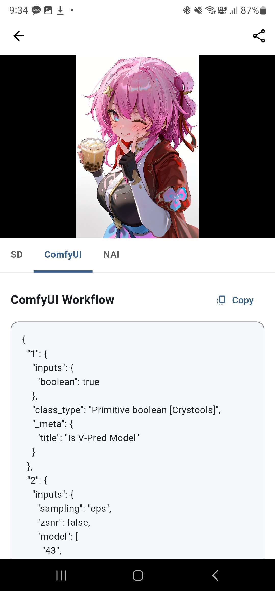
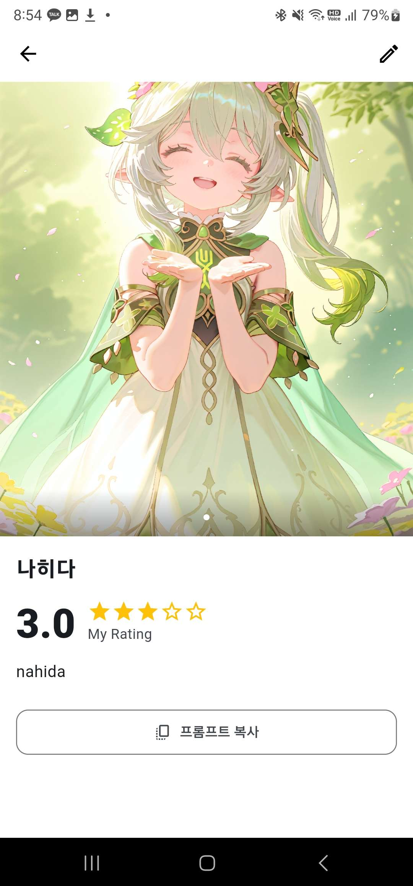
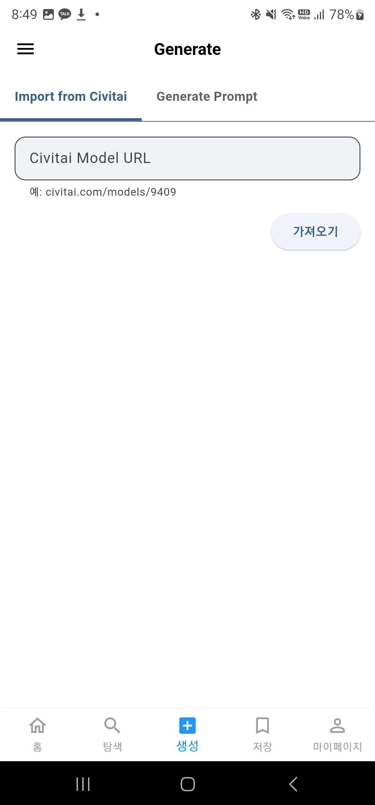
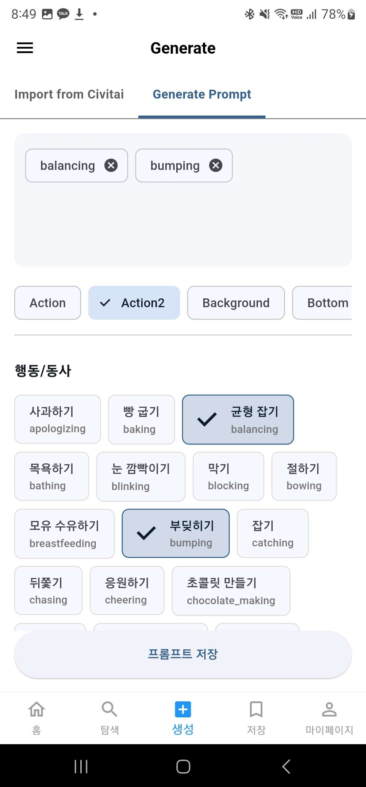
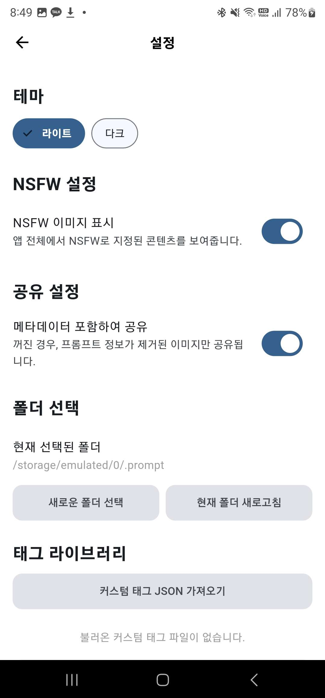
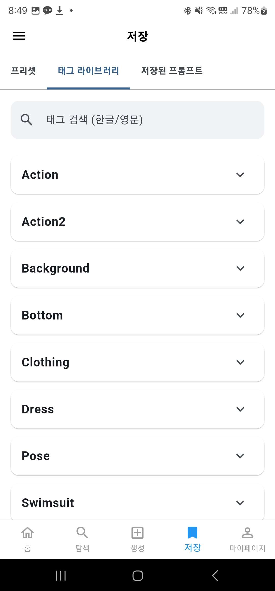

# Prompt Viewer 🖼️

**당신의 AI 아트, 당신의 프롬프트, 이제 한곳에서 완벽하게 관리하세요.**

흩어져 있는 AI 생성 이미지 폴더, 더 이상 뒤적이지 마세요. **Prompt Viewer**는 Stable Diffusion, ComfyUI, NovelAI로 생성된 이미지에 숨겨진 프롬프트와 생성 데이터를 자동으로 읽어와, 강력한 갤러리 기능과 함께 보여주는 안드로이드 네이티브 앱입니다.

---

## 🖼️ 주요 기능 스크린샷

| 갤러리 & 검색 | 프롬프트 상세 보기 | 프리셋으로 관리 | Civitai 연동 |
| :---: | :---: | :---: | :---: |
|  |   |  |   |
| **폴더별**로 이미지를 보고 **프롬프트 내용**으로 검색할 수 있습니다. | 이미지를 길게 눌러 **즐겨찾기, 별점, NSFW 지정** 등을 할 수 있습니다. | 마음에 드는 프롬프트와 이미지를 **하나의 프리셋**으로 저장하세요. | **Civitai URL**만으로 이미지와 프롬프트를 바로 가져올 수 있습니다. |

 

<strong>✨ 더 많은 기능 둘러보기 (클릭)</strong>

 
<table>
  <tr>
    <td align="center"><strong>프롬프트 생성</strong></td>
    <td align="center"><strong>마이페이지</strong></td>
    <td align="center"><strong>상세 설정</strong></td>
    <td align="center"><strong>태그 라이브러리</strong></td>
  </tr>
  <tr>
    <td align="center"></td>
    <td align="center"></td>
    <td align="center"></td>
    <td align="center"></td>
   
  </tr>
</table>

## ✨ 주요 기능 상세

### 1. 지능적인 메타데이터 뷰어
- **완벽 호환**: Stable Diffusion(A1111), ComfyUI 워크플로우, NovelAI Comment 등 주요 생성기의 메타데이터를 자동으로 인식하고 파싱합니다.
- **깔끔한 정보 분리**: Positive, Negative 프롬프트와 Steps, Sampler, CFG Scale 등 기타 파라미터를 명확하게 구분하여 보여줍니다.
- **간편한 복사**: 각 섹션별로 복사 버튼을 제공하여 프롬프트를 손쉽게 재활용할 수 있습니다.

### 2. 강력한 갤러리 관리
- **폴더 기반 탐색**: 여러 폴더를 동시에 관리하며, 탭으로 간편하게 폴더를 전환할 수 있습니다.
- **사용자 맞춤 관리**: 즐겨찾기(⭐), 0.5 단위의 세밀한 별점(🌟) 부여 기능으로 나만의 컬렉션을 만들어보세요.
- **NSFW 콘텐츠 필터링**: 설정에서 NSFW 이미지 표시 여부를 손쉽게 토글하여 공공장소에서도 안심하고 사용할 수 있습니다.
- **하위 폴더 동기화**: 선택한 폴더의 모든 하위 폴더까지 한 번에 스캔하여 라이브러리에 추가합니다.

### 3. '프리셋'으로 만드는 나만의 프롬프트 북
- **프롬프트와 이미지의 결합**: 마음에 드는 결과물의 프롬프트와 연관 이미지들을 하나의 '프리셋'으로 묶어 저장할 수 있습니다.
- **시각적인 관리**: 프리셋은 대표 이미지(썸네일)와 함께 표시되어 어떤 프롬프트였는지 직관적으로 파악할 수 있습니다.

### 4. 영감을 주는 프롬프트 생성 도구
- **내장 태그 라이브러리**: 다양한 카테고리로 분류된 태그 라이브러리를 검색하고, 터치하여 프롬프트를 손쉽게 조합할 수 있습니다.
- **커스텀 태그 확장**: 직접 만든 태그 JSON 파일을 가져와 라이브러리를 무한히 확장할 수 있습니다.
- **Civitai 연동**: Civitai 모델 URL만 입력하면, 다른 사용자들이 만든 이미지와 프롬프트를 내 갤러리로 즉시 다운로드할 수 있습니다.

## 🚀 설치하기

1.  본 저장소의 **[Releases 페이지](https://github.com/squirrel765/Prompt_Viewer/releases)**로 이동합니다.
2.  가장 최신 버전의 `app-release.apk` 파일을 다운로드합니다.
3.  다운로드한 APK 파일을 안드로이드 기기에서 실행하여 설치합니다.
    - _(설치 과정에서 '출처를 알 수 없는 앱 설치' 권한을 허용해야 할 수 있습니다.)_

---
## Comfyui에서 SD형식으로 프롬프트 저장하기
  

#### 위 노드를 사용해서 저장해주세요.

## 🛠️ 기술 스택

-   **Framework**: Flutter 3.x
-   **State Management**: Flutter Riverpod
-   **Database**: `sqflite` (로컬 데이터베이스)
-   **Asynchronous**: `Future` & `Stream`
-   **UI/Design**: Material 3 (Light/Dark Theme 지원)
-   **Permissions & File System**: `permission_handler`, `file_picker`
-   **Image Metadata Parsing**: `image` package

## 🗺️ 향후 로드맵

-   [ ] 대용량(1,000장 이상) 이미지 폴더 파싱 시 성능 최적화 (백그라운드 처리 도입)
-   [ ] 태블릿 및 데스크탑 환경을 위한 반응형 UI 지원
-   [ ] 별점, 즐겨찾기, 생성일 등으로 정렬하는 고급 필터링 기능
-   [ ] 키워드 하이라이팅 및 프롬프트 편집 기능
-   [ ] (선택사항) WebDAV 또는 클라우드 동기화 기능

## 🤝 기여하기

버그 리포트, 기능 제안, 코드 기여 등 모든 종류의 기여를 환영합니다!
1.  이 저장소를 Fork 하세요.
2.  새로운 브랜치를 만드세요 (`git checkout -b feature/AmazingFeature`).
3.  변경사항을 커밋하세요 (`git commit -m 'Add some AmazingFeature'`).
4.  브랜치에 푸시하세요 (`git push origin feature/AmazingFeature`).
5.  Pull Request를 열어주세요.

또는 간단하게 **[Issues](https://github.com/squirrel765/Prompt_Viewer/issues)** 탭에 제안이나 버그를 등록해주셔도 좋습니다.

## 📄 라이선스

이 프로젝트는 **MIT License**를 따릅니다. 자세한 내용은 [`LICENSE`](LICENSE) 파일을 참고해주세요.